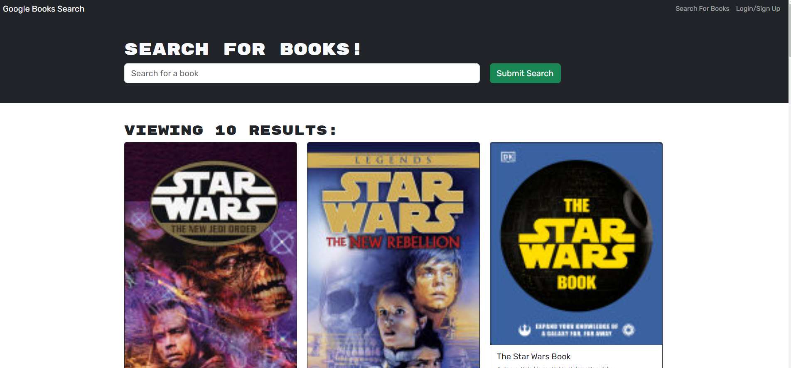
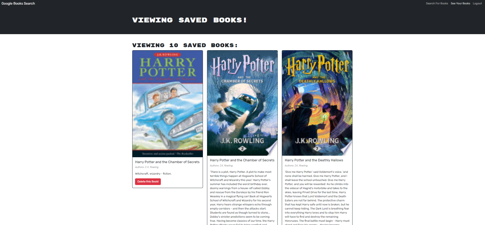
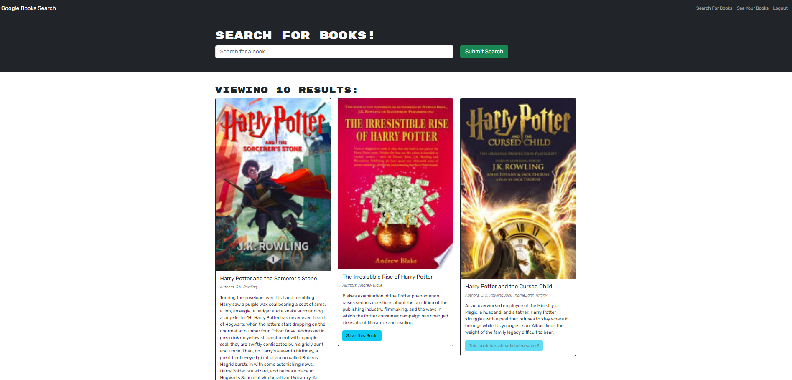
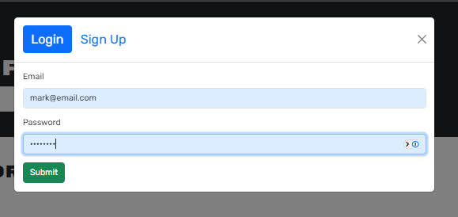

# Bootcamp Challenge Week Twenty - React: Developer's Profile
[](https://opensource.org/licenses/MIT)


## Description

The purpose of this application is to test my knowledge of React. including Props, Components, Event handling, State, Input forms, conditional rendering, react-router.

This application is a portforlio of my acheivements as a developer so far, by building a single page website through using React

In this project i learnt how to create a single page website using react and while also providing a refressher on previous topics such as css and bootstrap.

## Table of Contents
    
- [User Story](#user-story)
- [Acceptance Criteria](#acceptance-criteria)
- [Installation](#installation)
- [Testing](#testing)
- [Usage](#usage)
- [Screenshots/Video](<#screenshots--video-of-completed-challenge>)
- [License](#license)
- [Credits](#credits)
- [Questions / How to Contribute](#questions--how-to-contribute)

## User Story

```
AS AN employer looking for candidates with experience building single-page applications
I WANT to view a potential employee's deployed React portfolio of work samples
SO THAT I can assess whether they're a good candidate for an open position
```

## Acceptance Criteria

```
GIVEN a single-page application portfolio for a web developer
WHEN I load the portfolio
THEN I am presented with a page containing a header, a section for content, and a footer
WHEN I view the header
THEN I am presented with the developer's name and navigation with titles corresponding to different sections of the portfolio
WHEN I view the navigation titles
THEN I am presented with the titles About Me, Portfolio, Contact, and Resume, and the title corresponding to the current section is highlighted
WHEN I click on a navigation title
THEN I am presented with the corresponding section below the navigation without the page reloading and that title is highlighted
WHEN I load the portfolio the first time
THEN the About Me title and section are selected by default
WHEN I am presented with the About Me section
THEN I see a recent photo or avatar of the developer and a short bio about them
WHEN I am presented with the Portfolio section
THEN I see titled images of six of the developer’s applications with links to both the deployed applications and the corresponding GitHub repository
WHEN I am presented with the Contact section
THEN I see a contact form with fields for a name, an email address, and a message
WHEN I move my cursor out of one of the form fields without entering text
THEN I receive a notification that this field is required
WHEN I enter text into the email address field
THEN I receive a notification if I have entered an invalid email address
WHEN I am presented with the Resume section
THEN I see a link to a downloadable resume and a list of the developer’s proficiencies
WHEN I view the footer
THEN I am presented with text or icon links to the developer’s GitHub and LinkedIn profiles, and their profile on a third platform (Stack Overflow, Twitter) 
```

## Installation

then from the terminal inside the 'root' directory, run the following command to install the necessary dependancies.
       
    npm install


## Testing

No self tests exist for this application.

## Usage
    
Open the terminal in the 'root' Folder and enter the following command.

    npm run start

Then use insomnia to communicate with the API interface. 


## GitHub repository
https://github.com/mlewis89/wk20_react_Profile


## Netify Hosting
https://verdant-sable-f6ff70.netlify.app/

## Screenshots of Completed Challenge






## License
This project is licensed under the MIT.
    
## Questions / How to Contribute
    
If you have any questions about the repo, open an issue. You can veiw my other work on git hub [mlewis89](https://github.com/mlewis89/)

## Credits

Monash University Full Stack Coding bootcamp


---
